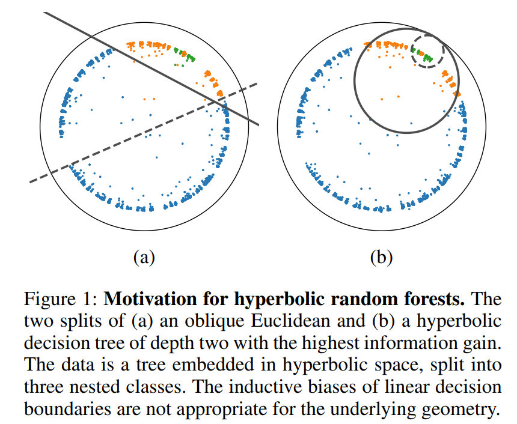

# Hyperbolic Random Forests

This is the official repository for the paper [Hyperbolic Random Forests](https://arxiv.org/abs/2308.13279).

### Abstract: 
Hyperbolic space is becoming a popular choice for representing data due to the hierarchical structure - whether implicit or explicit - of many real-world datasets. Along with it comes a need for algorithms capable of solving fundamental tasks, such as classification, in hyperbolic space. Recently, multiple papers have investigated hyperbolic alternatives to hyperplane-based classifiers, such as logistic regression and SVMs. While effective, these approaches struggle with more complex hierarchical data. We, therefore, propose to generalize the well-known random forests to hyperbolic space. We do this by redefining the notion of a split using horospheres. Since finding the globally optimal split is computationally intractable, we find candidate horospheres through a large-margin classifier. To make hyperbolic random forests work on multi-class data and imbalanced experiments, we furthermore outline a new method for combining classes based on their lowest common ancestor and a class-balanced version of the large-margin loss. Experiments on standard and new benchmarks show that our approach outperforms both conventional random forest algorithms and recent hyperbolic classifiers.



## Data

The network embeddings can be downloaded from [this repository](https://github.com/hhcho/hyplinear). We will provide the WordNet embeddings soon.

## Acknowledgements
- We make use of the [Hyperbolic Hierarchical Clustering](https://github.com/HazyResearch/HypHC) and [Hyperbolic Image Embeddings](https://github.com/leymir/hyperbolic-image-embeddings) repositories.

## Citation
If you find our work relevant to your research, please cite:
```
@article{doorenbos2023hyperbolic,
  title={Hyperbolic Random Forests},
  author={Doorenbos, Lars and M{\'a}rquez-Neila, Pablo and Sznitman, Raphael and Mettes, Pascal},
  journal={arXiv preprint arXiv:2308.13279},
  year={2023}
}
```

## License
The code is published under the [MIT License](LICENSE).
